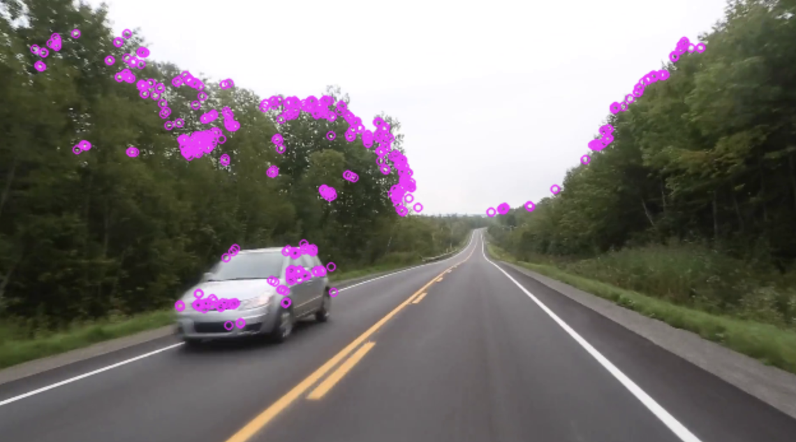

# Monocular Visual SLAM

SLAM (simultaneous localization and mapping) is a method used for autonomous vehicles, or anything else that moves around, that lets you build a map and localize your vehicle in that map at the same time. SLAM algorithms allow the vehicle to map out unknown environments. Engineers use the map information to carry out tasks such as path planning and obstacle avoidance. It is used very widely in any kind of robotics applications that require the robot to move around a new environment.

I am using OpenCV to help compute things like features in a frame, using ORB. I plan on using PyGame to actually map the 3D display with the points in time and space.

Things needed to make the map:

1. Triangulation from landmarks

- Humans and most animals have two eyes, because that allows us to figure out where objects are relative to us using triangulation
  

2. Localization: inferring location given a map.
3. Mapping: inferring a map given locations.

Loop closure:

- Once we come to a full circle, we can correct our mental map and adjust for the noise that had accumulated

Structure from Motion

- The problem of reconstructing the 3D structure of the environment from a collection of 2D images.
- The goal is to estimate where the camera was when each image was taken. Below shows an example image with ORB in action.
  
